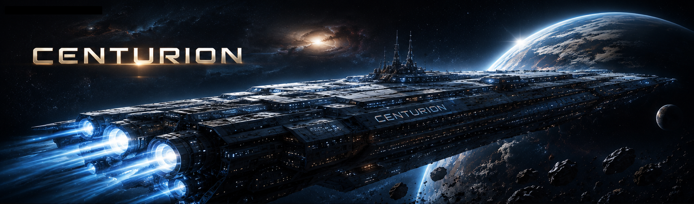

<h1 align="center">CENTURION</h1>

> **A sci-fi crew survival game where every decision has consequences.**

## About the Game

**Centurion** is a sci-fi survival strategy game focused on crew management, resource management and consequential decision-making.

You are responsible for a small crew operating in an unknown and hostile environment. Every crew member has their own strengths, weaknesses, personality and hidden secrets.

Your decisions affect not only your immediate resources, but also the condition of your crew, their relationships and the events that may unfold later in the mission.

There is no guaranteed safe choice.

## Getting started

The game runs directly in a modern web browser such as Google Chrome, Mozilla Firefox or Microsoft Edge.

No additional software or installation is required.

Launch the application, assemble your crew and begin the mission.

## How to Play

### 1. Assemble Your Crew

Select the crew members who will take part in the mission.

Each character has individual:

- **Health**
- **Stamina**
- **Sanity**
- **Hunger**
- **Skills**
- **Personality traits**
- **Relationships**
- **Secret**

Your selected crew forms the active team for the mission.

After selecting you will get a random personality and a random birthday. The age will be the base of the stats, the personality for the relations.

### 2. Manage Your Crew

Keep an eye on the condition of every crew member.

Character statistics can change as a result of events and decisions.

Low statistics may make future situations more difficult, while poor conditions can eventually put a crew member's survival at risk.

Characters who die or leave the mission are no longer part of the active crew.

### 3. Manage Resources

Your crew depends on limited resources such as:

- **Food**
- **Water**
- **Energy**
- **Oxygen**

Resources are consumed as time passes and can also be gained or lost through events.

Use them carefully. Running out of an essential resource can make future events significantly more difficult.

### 4. Advance Time

Use **Advance Time** to move the mission forward.

Each time you advance, a random amount of time passes.

The length of the time jump can affect:

- Resource consumption
- Crew condition
- Hunger
- Future events
- The overall state of the mission

Longer time jumps can therefore have a significant impact on your available resources.

### 5. Resolve Events

As time passes, different events will occur.

Read each event carefully and select one of the available choices.

Some choices are simple, while others may require you to:

- Select a specific crew member
- Perform a skill check
- Spend or gain resources
- Accept a negative consequence
- Change relationships
- Trigger a hidden secret

Your decisions can influence events later in the mission.

### 6. Character Selection

Some actions require a specific crew member.

When this happens, select the character who should perform the action and confirm your choice.

The selected character may be affected by the outcome, so consider their current stats and skills before making your decision.

### 7. Skill Checks

Certain events require a **Skill Check**.

The selected character's relevant skill is combined with a random dice roll (value from 1 to 6).

The resulting total is compared with the event's required difficulty.

Failure may trigger different consequences from the normal outcome.

### 8. Secrets

Every crew member can receive a hidden Secret Card.

Secrets remain hidden until their specific trigger occurs.

When a secret is triggered:

- the secret is revealed.
- its effect is applied.
- the affected character is identified.
- the secret and its consequences are shown in the event result.

Secrets can affect character statistics, skills, personality or relationships.

Some secrets may have significant consequences, so not every event is exactly what it appears to be.

### 9. Relationship

Crew relationships can change throughout the mission.

Events may improve or damage relationships between crew members or affect the crew as a whole.

Maintaining a stable crew can become increasingly important as the mission progresses.

### 10. Hunger

Hunger represents a character's additional food requirement.

When an event increases hunger, additional food is required to satisfy it.

The current food system follows these basic rules:

- 1 active crew member = 1 Food per day  
- 1 Hunger = 1 additional Food  
- Above 30 Hunger the character loses 1 Health per day. Consume Food to reset Hunger to 0.

If enough food is available to satisfy a character's hunger, the hunger value is completely cleared.

### 11. Survive

There is no single correct way to approach the mission.

You must balance:

- Crew condition
- Resources
- Skills
- Relationships
- Time
- Risk
- Hidden consequences

A decision that appears beneficial in the short term may create problems later.

The objective is simple: **keep the crew alive as long as you can**.

### Game Over

The mission can end if the crew becomes unable to continue.

Losing important crew members, exhausting critical resources or allowing the crew's condition to deteriorate too far can ultimately lead to failure.

## Under Development

The following features are currently being developed or refined:

- Logic of the death development
- Additional event cards and secret events
- Option for creating AI generated event cards
- Additional crew interactions and relationship mechanics
- More event effects and gameplay consequences
- UI and UX improvements
- Intro and How to play section creation
- Additional game content and balancing
  
✓ Mobile-friend version  
✓ Hunger and food consumption system
✓ Skillcheck update with clickable dice
✓ Aging improvements (adding birthday)
✓ Character progression and balancing

Features listed here are subject to change as development continues.

## Built with

**Frontend:**

- [React](https://react.dev/)
- [TypeScript](https://www.typescriptlang.org/)
- [Tailwind CSS](https://tailwindcss.com/)
- [Zustand](https://zustand.docs.pmnd.rs/)

#### AI Assistance
- AI-assisted development with ChatGPT and Claude

## Version

*1.0 - August 2026* - Initial release of the application

## Author

Kornel Frikton - [GitHub](https://github.com/KornelFrikton)

## Licence

This application was built for fun. Feel free to use, modify and expand it :)